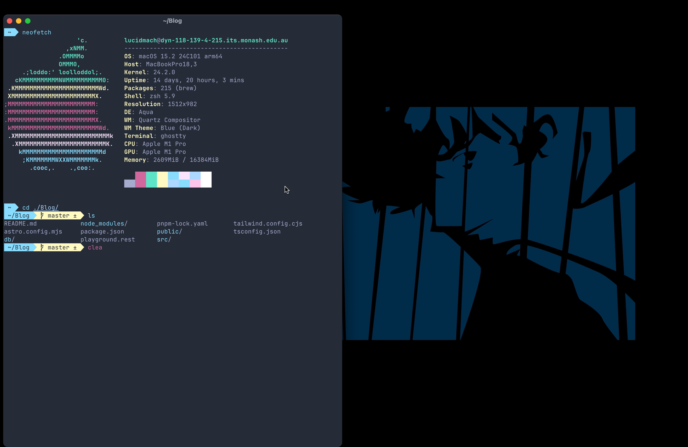

# Poimandres-Ghostty

unofficial [poimandres](https://github.com/z0al/poimandres-alacritty/) theme for [ghostty terminal](https://ghostty.org/) [storm theme only (for now)]

## ScreenShot

## installation

simply copy the content of `config` to `~/.config/ghostty/config`

## Related

- [poimandres-theme](poimandres): VS Code version
- [poimandres-iterm](poimandres-iterm): Iterm version
- [poimandres-alacritty](poimandres-alacritty): Alacritty version
