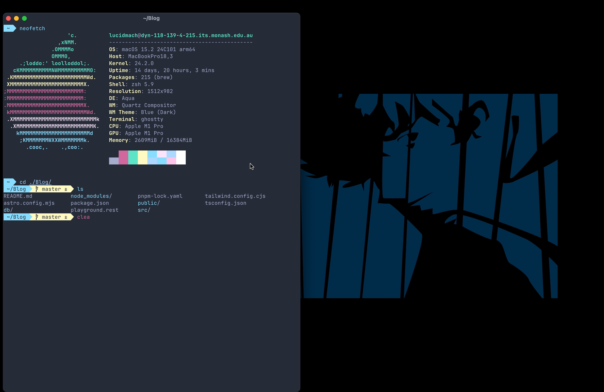
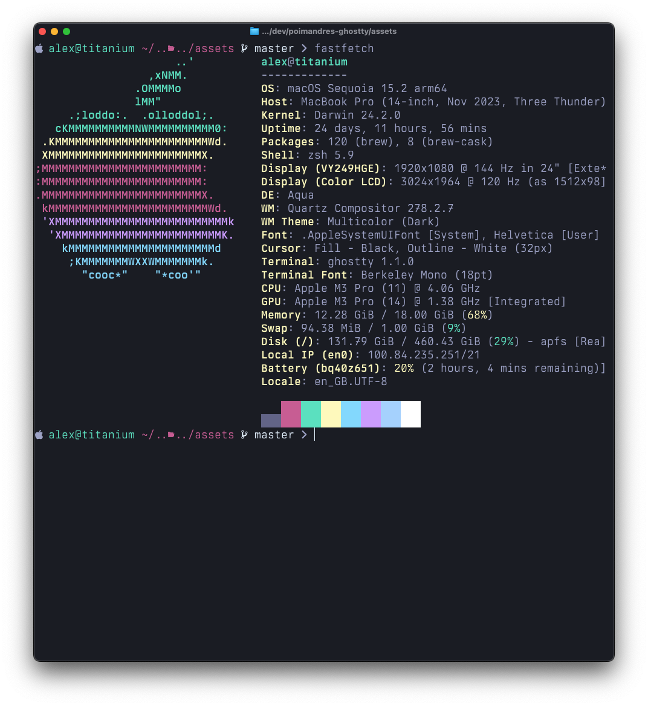

# Poimandres-Ghostty

Unofficial [poimandres](https://github.com/z0al/poimandres-alacritty/) theme for [ghostty terminal](https://ghostty.org/)

## Screenshot

## Installation

Copy the content of either poimandres-storm or poimandres to `~/.config/ghostty/config`.

## Related

- [poimandres-theme](poimandres): VS Code version
- [poimandres-iterm](poimandres-iterm): Iterm version
- [poimandres-alacritty](poimandres-alacritty): Alacritty version
