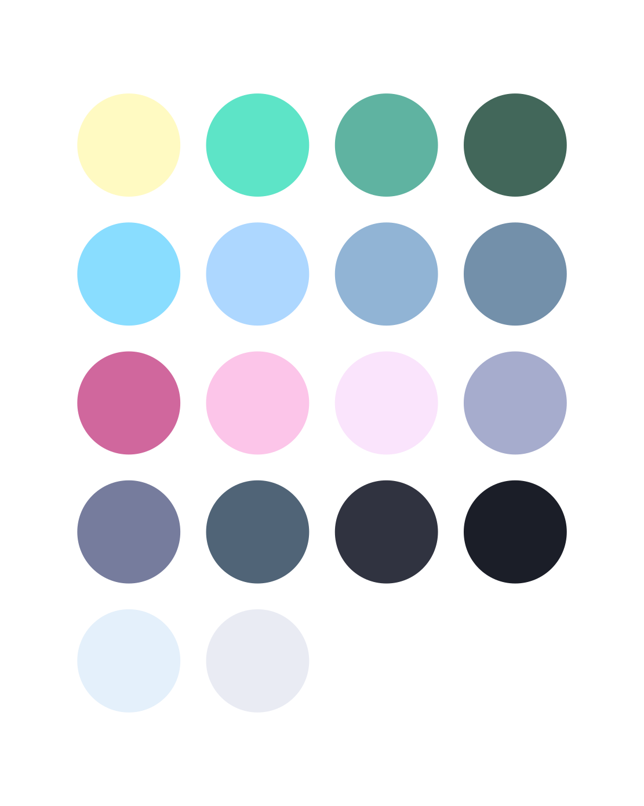
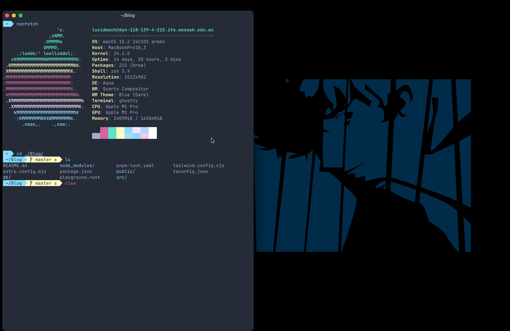
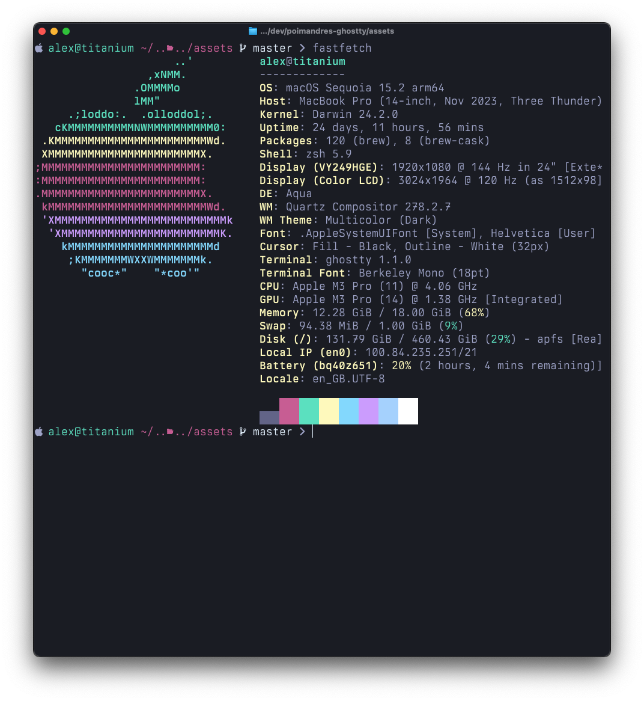

# Poimandres-Ghostty

Unofficial [poimandres](https://github.com/z0al/poimandres-alacritty/) theme for [ghostty terminal](https://ghostty.org/)

## Screenshot

<center>





</center>

## Installation

Run the following command:

### For `poimandres` (default colorscheme)
```bash
curl -o ~/.config/ghostty/themes/poimandres https://raw.githubusercontent.com/LucidMach/poimandres-ghostty/refs/heads/master/poimandres
```

### For `poimandres-storm` (colorscheme variation)
```bash
curl -o ~/.config/ghostty/themes/poimandres-storm https://raw.githubusercontent.com/LucidMach/poimandres-ghostty/refs/heads/master/poimandres-storm
```

## Usage

- Open your Ghostty config file. It can either be done through the UI:


Or by pressing `⌘ ,`.

- Set the theme by adding `theme=poimandres` or `theme=poimandres-storm` to the config file.
- Save it and reload the config using the `⇧ ⌘ ,` combination. It should reflect it afterwards.
- You're set!


## Related

- [poimandres-theme](poimandres): VS Code version
- [poimandres-iterm](poimandres-iterm): Iterm version
- [poimandres-alacritty](poimandres-alacritty): Alacritty version
